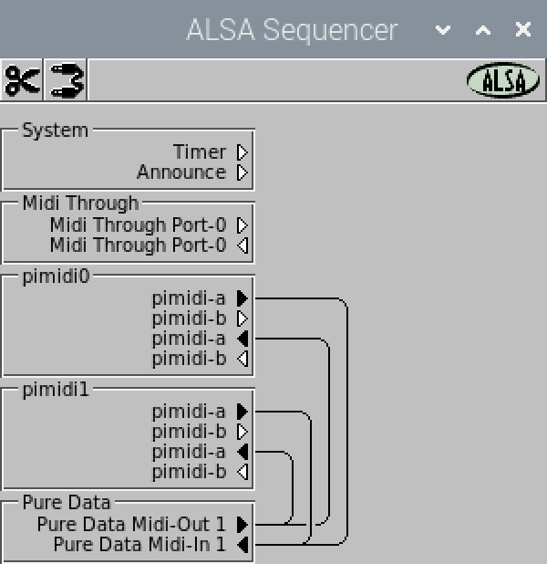

# ALSA

## Introduction

The Advanced Linux Sound Architecture (ALSA) provides audio and MIDI functionality to the Linux operating system.
It provides two distinct methods of communicating MIDI between software and hardware: RawMIDI and ALSA Sequencer.

If possible, prefer configuring your software to use ALSA Sequencer over RawMIDI, as ALSA Sequencer provides more flexibility
when using the same MIDI ports for multiple hardware and software endpoints, while RawMIDI gives exclusive MIDI port access to
only a single application at a time.

## RawMIDI

The RawMIDI interface gives a software application exclusive access to a hardware MIDI port, allowing raw MIDI data read/write access.
Communication between software programs using RawMIDI is only possible through the use of a virtual RawMIDI loopback device.

### RawMIDI Device Identifiers

Run `amidi -l` to see the list of RawMIDI devices available to your system:

```bash
patch@patchbox:~ $ amidi -l
Dir Device    Name
IO  hw:0,0,0  pimidi0-a
IO  hw:0,0,1  pimidi0-b
```

The `hw:0,0,0` and `hw:0,0,1` refer to Pimidi's (which has `sel` set to 0) input & output ports A and B, respectively.

However, the `hw:0` part may change unpredictably as you connect more devices and restart your system. It is better to use hardware
identifiers that are persistent. Instead of the `hw:0` prefix, we may use `hw:pimidi0`, and it will stay the same as long as the `sel`
rotary switch is not changed on the board.

Therefore, prefer using `hw:pimidi0,0,0` and `hw:pimidi0,0,1` to refer to its A and B ports.

If you have a 2nd Pimidi board with `sel` set to 3, you can use `hw:pimidi3,0,0` and `hw:pimidi3,0,1` as persistent identifiers.

### RawMIDI Pimidi Identifiers

Here is a list of all possible Pimidi RawMIDI persistent identifiers:

| `sel` Position | RawMIDI Identifier for Port A | RawMIDI Identifier for Port B |
| -------------- | ----------------------------- | ----------------------------- |
| 0              | `hw:pimidi0,0,0`              | `hw:pimidi0,0,1`              |
| 1              | `hw:pimidi1,0,0`              | `hw:pimidi1,0,1`              |
| 2              | `hw:pimidi2,0,0`              | `hw:pimidi2,0,1`              |
| 3              | `hw:pimidi3,0,0`              | `hw:pimidi3,0,1`              |

Run `cat /proc/asound/cards` and inspect the output to find the prefixes of other RawMIDI ports:

```text
patch@patchbox:~ $ cat /proc/asound/cards
 0 [pimidi0        ]: snd-pimidi - pimidi0
                      pimidi0 PM-197PEJ5
 1 [MH1RSEMAR      ]: USB-Audio - Midihub MH-1RSEMAR
                      Blokas Midihub MH-1RSEMAR at usb-xhci-hcd.0-2, full speed
...
```

Note the name part in between the `[` and `]`.

### ALSA `amidi` Utility

Using `amidi`, you may inspect your MIDI devices, as well as send and receive raw MIDI data. Here's how to perform some of the most common tasks:

#### Monitoring Incoming Data

Let's say we'd like to monitor everything that's coming into Pimidi's A input port. We can run a command like this:

```bash
patch@patchbox:~ $ amidi -p hw:pimidi0,0,0 -a -c -d
```

It will print to the terminal all the incoming messages, including Active Sense and Clock. You can terminate it by pressing Ctrl+C.

#### Sending Hex Bytes

Occasionally, you may want to send out a particular sequence of MIDI messages to see how the receiving device will respond to them. Sometimes there is no better way than to send out hand-crafted Hex MIDI bytes. Here's an example of how to send out Note On and Off for Middle C (note number 60) with Velocity 100:

```bash
patch@patchbox:~ $ amidi -p hw:pimidi0,0,0 -S "90 3C 64"
patch@patchbox:~ $ amidi -p hw:pimidi0,0,0 -S "80 3C 00"
```

Here's how to interpret the Hex bytes we just sent - most MIDI messages consist of up to 3 bytes. The length (and message type) is determined by the very first digi, in this case, `9` is the Note On, and `8` is the Note Off. Both of these messages are 3 bytes in length. The next digit is usually the MIDI Channel number. In this case, `0` - `F` indicate MIDI channels 1 - 16. Then 2 data bytes follow, they must be between `00` and `7F` (0 and 127 decimal). The first data byte, `3C`, is decimal 60 encoded as a hex number, and it represents the Note Number in the case of Note On and Note Off messages. The second data byte, `64`, is decimal 100 encoded as a hex number, and it represents the Note Velocity.

Familiarizing yourself with the [Summary of MIDI Messages](https://midi.org/summary-of-midi-1-0-messages){target=_blank} table is very helpful to be able to inspect and type out raw MIDI messages.

#### Receiving a Data Dump

Most synths with persistent storage have an option to send out a SysEx dump to create a backup of all the presets and projects stored in its memory.
Just before triggering the send on the synth, you'd want to first set up your system to receive the data dump to a file. If your synth's MIDI
output is connected to Pimidi's A input, run a command like this:

```bash
patch@patchbox:~ $ amidi -p hw:pimidi0,0,0 -r backup.syx
```

Once the synth is finished sending (as can be confirmed by the Pimidi's activity LEDs indicating no activity), terminate the reception of data by pressing
Ctrl+C. `amidi` should print out the amount of bytes it has received since it was started.

#### Sending a Data Dump

Sometimes you might want to restore a backup or some synths even accept firmware upgrades in form of SysEx blobs sent to their MIDI inputs. Here's how
to send out a raw data file to Pimidi's A output port:

```bash
patch@patchbox:~ $ amidi -p hw:pimidi0,0,0 -s firmware.syx
```

Depending on the size of the data, it may take a little while for the transfer to complete, as the speed of MIDI is 3125 bytes per second. The command will exit automatically once the transfer is complete.

### RawMIDI Code Examples

* C language: [https://github.com/alsa-project/alsa-lib/blob/master/test/rawmidi.c](https://github.com/alsa-project/alsa-lib/blob/master/test/rawmidi.c){target=_blank}

## ALSA Sequencer

ALSA Sequencer is the Linux subsystem that facilitates MIDI software and hardware interoperation.

It also holds a global graph of interconnections between ports and software, allowing you to set up the MIDI data routings between MIDI 

ALSA Sequencer is more flexible than the RawMIDI counterpart as it allows simultaneous access to the same ports at the same time, and MIDI software can create its own virtual MIDI ports, also routable within the MIDI graph.

### ALSA Sequencer Device Identifiers

ALSA Sequencer MIDI Port Names are made up of two parts - the Client Name/ID and the Port Name/ID separated by a colon (:).

If you run `aconnect -l`, you'll get output similar to this:

```
patch@patchbox:~ $ aconnect -l
client 0: 'System' [type=kernel]
    0 'Timer           '
    1 'Announce        '
client 14: 'Midi Through' [type=kernel]
    0 'Midi Through Port-0'
client 28: 'pimidi0' [type=kernel,card=3]
    0 'pimidi-a        '
    1 'pimidi-b        '
client 32: 'pimidi1' [type=kernel,card=4]
    0 'pimidi-a        '
    1 'pimidi-b        '
```

Based on this output, we can see the `28:0` and `28:1` addresses are referring to Pimidi's (with `sel=0`) A and B ports, as well as `32:0` and `32:1` are referring to Pimidi's (with `sel=1`) A and B ports. However, there's no guarantees that the assigned Client ID will be the same after a system restart or even within the same session, especially for removable devices, such as USB MIDI controllers. Therefore, as ALSA Sequencer also accepts text names, the most stable way to refer to the device is using identifiers like `pimidi0:0` for Pimidi's port A and `pimidi0:1` for port B.

Furthermore, when using a Client Name, ALSA actually treats it as a prefix - it does not have to be an exact match, it's enough to match partially. For example, using `pimidi:1` would match `pimidi0:1` port as well. If the prefix matches multiple clients, one of them gets picked.

### ALSA Sequencer Pimidi Identifiers

Here is a list of all possible ALSA Sequencer Pimidi persistent identifiers:

| `sel` Position | ALSA Seq Identifier for Port A | ALSA Seq Identifier for Port B |
| -------------- | ------------------------------ | ------------------------------ |
| 0              | `pimidi0:0`                    | `pimidi0:1`                    |
| 1              | `pimidi1:0`                    | `pimidi1:1`                    |
| 2              | `pimidi2:0`                    | `pimidi2:1`                    |
| 3              | `pimidi3:0`                    | `pimidi3:1`                    |

### Managing the MIDI Connection Graph

There's many tools available for setting up the ALSA Sequencer MIDI connection graph, we'll look at a handful of them.

#### Using `amidiminder`

The Amidiminder utility keeps the connection graph up to date according to a set of rules defined in its configuration file, and it also takes care of MIDI devices that get connected and disconnected automatically. See the dedicated [Amidiminder tutorial page](amidiminder.md) for more details.

#### Using `aconnect`

The `aconnect` command line utility allows managing the MIDI graph using a terminal console. One thing to note is that connections are not restored automatically if a device, such as a USB MIDI controller, got unplugged, and plugged in again, unless you're using `amidiminder` described above.

Let's say we'd like to forward whatever is coming in on Pimidi `sel=0` A input port to B output port, we'd use the utility like this:

```bash
patch@patchbox:~ $ aconnect pimidi0:0 pimidi0:1
```

The order of arguments is important - the first port is the source port that produces events (such as on receiving external input), the 2nd port is the destination port that consumes the events (such as an output port that sends the events to external devices).

After this command is executed, we may double-check the current MIDI graph connections by executing `aconnect -l`:

```bash
patch@patchbox:~ $ aconnect -l
...
client 28: 'pimidi0' [type=kernel,card=3]
    0 'pimidi-a        '
        Connecting To: 28:1
    1 'pimidi-b        '
        Connected From: 28:0
...
```

The 'Connecting To' and 'Connecting From' parts confirm that the connection we've just requested is active.

We can disconnect a particular connection like this:

```bash
patch@patchbox:~ $ aconnect -d pimidi0:0 pimidi0:1
```

Or we may disconnect all ALSA Sequencer MIDI connections by issuing a:

```bash
patch@patchbox:~ $ aconnect -x
```

#### Using `aconnectgui`

{width=50% height=50%}

Aconnectgui is a simple graphical user interface for the `aconnect` utility described just above. 

It indicates source ports with a triangle pointing to the right ▶ and the destination ports with a triangle pointing to the ◀ left.

Enable the connection tool and drag from one port's end to another's of opposing directions to make the MIDI connection between the ports.

Use the scissors tool to disconnect port connections.

### Monitoring MIDI Events

#### Using `aseqdump`

Aseqdump works by creating a virtual input port to receive events and prints them out to the console. You may tell it which ports to subscribe to for event monitoring, but also you may make new connections to it and remove old ones while it is running using the methods described in prior section.

Let's say we want `aseqdump` to print out events that get sent to Pimidi's A input port, we'd start it like this:

```bash
patch@patchbox:~ $ aseqdump -p pimidi0:0
```

Now say we want to switch it to the B input port, we could do this in another terminal:

```bash
patch@patchbox:~ $ aconnect -d pimidi0:0 aseqdump:0
patch@patchbox:~ $ aconnect pimidi0:1 aseqdump:0
```

Hit Ctrl+C in the original terminal to exit `aseqdump`.

### Sending MIDI Events

#### Using `aseqwrite`

Similar to `amidi -S ...`, you may send arbitrary MIDI events to ALSA Sequencer ports, here's how to send a Note On and Off message from Pimidi's A output port:

```plain
patch@patchbox:~ $ aseqwrite pimidi0:0 90 3C 64
patch@patchbox:~ $ aseqwrite pimidi0:0 80 3C 00
```

For hexadecimal byte meanings, see the explanation in the [Sending Hex Bytes](#sending-hex-bytes) section.
