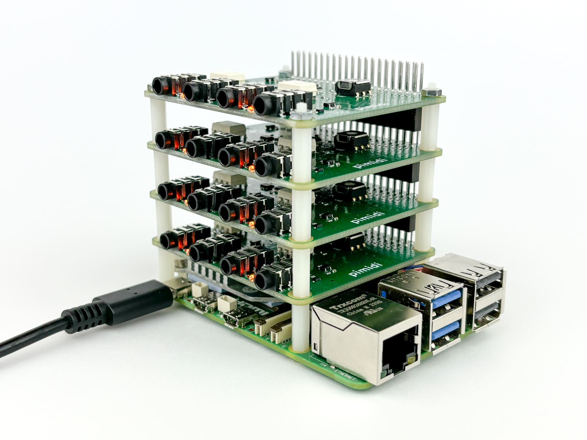

# Getting Started


Pimidi is a compact and stackable 2x2 MIDI interface for Raspberry Pi and compatible Single Board Computers (SBCs). The 3.5mm stereo port jacks follow the MIDI standard (Type A) and can be used with DIN-5 MIDI cables via an adapter.

Pimidi makes use of a minimal set of GPIO pins, and duplicates all of the 40 GPIO pins for easy access to integrate additional boards and external circuitry.

## Hardware Setup

Power off your Raspberry Pi or compatible SBC. Adjust the `sel` position of Pimidi if desired and make note of its current position. The default `sel` value is 0. You may want to pick other `sel` values when stacking multiple Pimidi boards or to make it use an alternative set of GPIO pins. See [here](advanced-configuration.md) for more on this.

### Assembling Pimidi


To assemble your Pimidi, follow these steps using the included mounting parts kit, which contains:

* 4 hex standoffs
* 4 screws
* 4 nuts

### Step-by-Step Assembly:


**1. Attach the Standoffs**

Insert the male thread of each hex standoff from the bottom side of the Pimidi board.

**2. Fix the Standoffs in Place**

Secure each standoff to the topmost Pimidi board by using the corresponding nut. Tighten the nut onto the standoff to hold it in place.

**3. Mount the Raspberry Pi**

Take the screws and insert them from the bottom side of the Raspberry Pi.

Screw them into the threaded ends of the Pimidi standoffs to secure the Raspberry Pi to the Pimidi.

**4. Stacking Additional Pimidi Boards (Optional)**



If you are stacking more than one Pimidi board, simply join the standoffs together to connect additional Pimidi units. Make sure to set the `sel` setting to a unique value for every Pimidi. Repeat the assembly steps for each added board.

<small>**Note**: If you are stacking multiple Pimidi boards, you will have 4 screws and 4 nuts remaining as spare parts per unit, since only one set of screws and nuts is needed per stack.</small>

Power up your system and continue with the Software setup below.

## Software Setup

To install the Pimidi software on Debian compatible distributions like <a href="https://www.raspberrypi.org/downloads/raspberry-pi-os/" target="_blank">Raspberry Pi OS</a>, open a terminal (command) window and run:

```
curl https://blokas.io/pimidi/install.sh | sh
```

This will set up the Blokas APT server, install all the software packages for Pimidi, scan for connected Pimidis, load the kernel module, and make the changes in `config.txt` so the Pimidis are ready to go every time the system starts.

**Note:** It can also be used for updating the software or update the `config.txt` if the number of boards or `sel` positions changed.

## Verifying It Works

Run `amidi -l` in a terminal, you should see the Pimidi device(s) listed among other MIDI devices available on the system.
