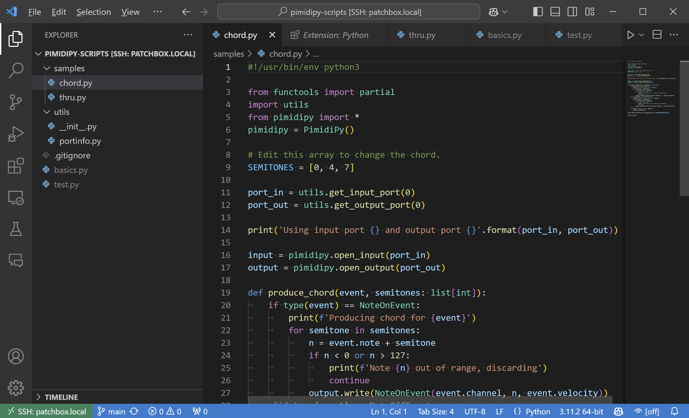

# Pimidipy Patchbox Module

Our [Patchbox OS](https://blokas.io/patchbox-os/){target=_blank} is built around the concept of [modules](https://blokas.io/patchbox-os/docs/modules/){target=_blank}. They effortlessly make your setup do interesting things. One of those things is processing and controlling MIDI data with Python. For that purpose, we've developed the [`pimidipy`](pimidipy.md) Python library. This Patchbox module makes running the scripts automatically as smooth as possible.

## Installing & Activating The pimidipy Module

Installing or activating the module is very straightforward, simply run `patchbox`, navigate to `module` and select `pimidipy`.

Once installation is done, you'll be asked to select the script to start. The script you pick will get started in the background. It will also be started automatically after system restarts too, until the Patchbox Module is switched to another or deactivated altogether.

To deactivate the module, select `none` instead of `pimidipy` or run `patchbox module deactivate`

## Managing pimidipy Scripts

The pimidipy scripts are located at `/var/pimidipy-scripts`. The root of the folder is for user scripts, while the `samples` subfolder contains example scripts (which you can run immediately). Every .py file in `/var/pimidipy-scripts` and `/var/pimidipy-scripts/samples` are listed when activating the module. You may copy files from the `samples` subfolder to the root folder to modify them (don't forget to re-activate the pimidipy module and point it to your own copy of the script)

The `utils` subfolder contains a couple of common utility functions for use in pimidipy scripts.

The active script gets restarted automatically every time `/var/pimidipy-scripts` contents get modified, even if the changes don't 'touch' the active script.

## Configuring pimidipy Ports

The sample pimidipy scripts use `utils.get_input_port(x)` and `utils.get_output_port(x)` utility function for selecting the MIDI ports to work with. Those can be overridden without editing the scripts themselves in `/etc/pimidipy.conf` file. Based on the ID number (`x` argument) provided to the function, it returns one of these strings:

| ID Number | Returned Port Name | ID Number | Returned Port Name |
| --------- | ------------------ | --------- | ------------------ |
| `0`       | `pimidi0:0`        | `4`       | `pimidi2:0`        |
| `1`       | `pimidi0:1`        | `5`       | `pimidi2:1`        |
| `2`       | `pimidi1:0`        | `6`       | `pimidi3:0`        |
| `3`       | `pimidi1:1`        | `7`       | `pimidi3:1`        |

Using ID number higher than 7 will result in an exception raised, unless there's an override for that number in `/etc/pimidipy.conf`.

If we'd want to use `pimidi2:1` input instead of `pimidi0:0` input and use `pimidi1:1` output instead of `pimidi0:0` output, we can add these lines to `/etc/pimidipy.conf`:

```
PORT_IN_0=pimidi2:1
PORT_OUT_0=pimidi1:1
```

The changes in the currently active script take place every time the config file gets modified automatically.

## Checking The Script Status and Output

To check whether the script is running fine, use this command:

```bash
sudo systemctl status pimidipy.service
```

To check the script's output, run:

```bash
journalctl -u pimidipy.service
```

Hit the 'End' key to go to the latest log lines. Click 'Q' to exit.

Optionally, add `-f` flag at the end of the `journalctl` command to follow the latest output automatically.

## Developing pimidipy Scripts

Use your favorite code editor to edit the files under `/var/pimidipy-scripts`. Every time you edit the scripts, the currently active script gets restarted automatically. You may want to keep `journalctl -u pimidipy.service -f` command running in a background terminal, to keep an eye on whether the script is running fine.

See the pimidipy [Library](pimidipy.md) and [Reference](pimidipy-reference.md) pages for API documentation.

### Visual Studio Code

Our favorite way of editing is using [Visual Studio Code](https://code.visualstudio.com/){target=_blank} to edit remotely via SSH.



Once you have Visual Studio installed and running, you'll have to install the [Remote SSH extension](https://marketplace.visualstudio.com/items?itemName=ms-vscode-remote.remote-ssh). Do so by opening the Extensions tab on the left of the screen and locating the extension.

Once the extension is installed, a new Remote Explorer tab will appear. Open it, click the '+' button while hovering over the SSH line. A textbox input at the top of the Visual Studio Code will appear. Enter `patch@patchbox.local` (or you may enter the IP of your Raspberry Pi instead of the `patchbox.local` part, if you know it). Hit 'Enter' to confirm. A new entry under the SSH tree will appear. Click the --> arrow while hovering with mouse over it, to connect to it. You will get prompted for the password, enter it and hit 'Enter'. When asked what kind of system it is, select `Linux`. Then click 'Continue' to confirm you trust the remote.

Finally, when connection is complete, open the Explorer tab using the icon button on the left. Click 'Open Folder' and enter `/var/pimidipy-scripts/`, click OK. You'll see the script files listed as a file tree. From there, you can open the files for editing.

When you save a file under that tree, the currently active pimidipy script will get restarted automatically, so that your changes can take effect.

For better editing experience, install the Python extension. It's best to do it while connected to your remote host, as the extension must be get installed on the remote host too.

To see live script output within Visual Studio code, open the Terminal tab (hit Ctrl + `). Run the following command:

```bash
journalctl -u pimidipy.service -f
```

Hit Ctrl + C to exit the `journalctl ` command.

### Monitoring MIDI Events

You may want to keep an eye on the actual outputs your script is producing. To do so, set the output port as `aseqdump:0` (like by defining it as your output in `/etc/pimidipy.conf`, for example `PORT_OUT_0=aseqdump:0`) and run `aseqdump` in a terminal. It should print out the MIDI events that it receives.

## Example Scripts

See the `pimidipy-scripts` [repository](https://github.com/BlokasLabs/pimidipy-scripts/){target=_blank} for up to date examples.

### MIDI THRU

The [`/var/pimidipy-scripts/samples/thru.py`](https://github.com/BlokasLabs/pimidipy-scripts/blob/main/samples/thru.py){target=_blank} script reads MIDI events from the port set by `PORT_IN_0` (pimidi0:0 by default), and forward the events to all `PORT_OUT_0` ... `PORT_OUT_7` ports.

### Chord

The [`/var/pimidipy-scripts/samples/chord.py`](https://github.com/BlokasLabs/pimidipy-scripts/blob/main/samples/chord.py){target=_blank} script produces MIDI chords for every note played. By default it produces the major triad chord, but you customize it by setting the `CHORD_SEMITONES` environment variable to a comma separated list of positive or negative semitone numbers in `/etc/pimidipy.conf`. For example:

```plain
CHORD_SEMITONES=-12,0,3,7
```

### CC Programmer for DX7

The [`/var/pimidipy-scripts/samples/dx7.py`](https://github.com/BlokasLabs/pimidipy-scripts/blob/main/samples/dx7.py){target=_blank} script implements a DX7 programmer using 8 CC controls in total - one for setting the bank of parameters, and the rest for modifying the parameters in the bank themselves.

The suggested layout is to use 4 by 2 knobs, where the top left knob is for the bank selection.

You can override the CC IDs used for the controls by editing `/etc/pimidipy.conf` and setting the following variables:

```plain
DX7_BANK_CONTROL_0=30
DX7_BANK_CONTROL_1=31
DX7_BANK_CONTROL_2=32
DX7_BANK_CONTROL_...=...
DX7_BANK_CONTROL_7=37
```

The 0 control is the one for selecting the bank.

By default, DX7 Device ID 1 is used, you may override this by setting the DX7_DEVICE_ID environment variable in `/etc/pimidipy.conf`. Use values 0-15 for device IDs 1-16.

You may also map CC controls to DX7 parameters directly by setting the following variables in `/etc/pimidipy.conf`:

```plain
DX7_PARAM_n=ch:cc_id

# or

DX7_PARAM_n=cc_id      # Channel 1 is assumed, equivalent to 0:cc_id
```

where `n` is the DX7 parameter ID (see the Parameters [table](https://github.com/BlokasLabs/pimidipy-scripts/blob/main/samples/dx7.py#L40){target=_blank}), `ch` is the MIDI channel number to listen to (use numbers between 0-15 for channels 1-16), and `cc_id` is the CC ID to listen to.

It's also possible to provide more than one CC ID for a parameter by separating them with a comma.
