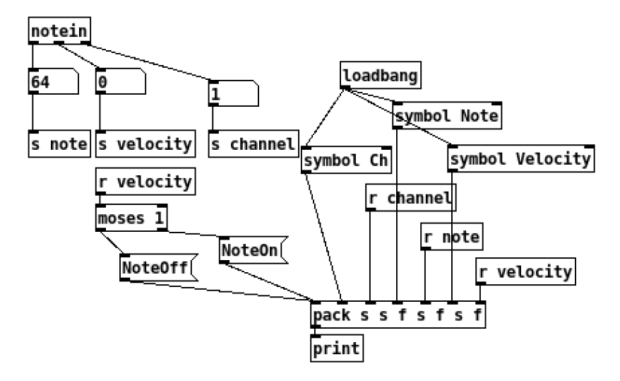
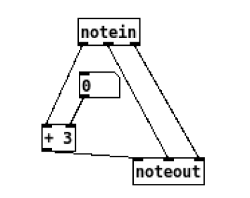

# Using MIDI with Pure Data

## Introduction
Pure Data (Pd) is a visual programming language developed for creating interactive computer music and multimedia works. This tutorial will guide you through the process of using MIDI with Pure Data. For more information, refer to the [Pure Data homepage](https://puredata.info/){target=_blank}.

## Setting Up MIDI in Pure Data

Pure Data uses ALSA Sequencer on Linux for MIDI, therefore, it creates a virtual MIDI port which is connectable in the ALSA MIDI graph. One detail to note - it creates two unidirectional ports instead of a single bidirectional port, so this is something to keep in mind when setting up the MIDI graph. Use `Pure Data:0` as Pure Data's Input port and `Pure Data:1` as its Output port.

If you have [`amidiminder`](amidiminder.md) running with the `.hw <-> .app` rule, the hardware and software ports will get automatically connected. Alternatively, you may have to make the connection manually, see [ALSA](alsa.md) for more details. A quick example for Pimidi `sel=0`:

```bash
aconnect pimidi0:0 "Pure Data:0"
aconnect "Pure Data:1" pimidi0:0
```

## Monitoring Note Input

Let's build a simple patch to print out the incoming notes:

{width=50% height=50%}

Try it for yourself: [note_monitor.pd](assets/note_monitor.pd)

The key object is the `[notein]` - it reacts to MIDI Note On and Note Off messages sent to Pure Data's virtual MIDI port. The first outlet is the note number, the second is the velocity and the third is the MIDI channel. Note Off events always make this object produce an event with 0 velocity.

## Transposing MIDI Notes

Now let's look at an even simpler Transpose patch:

{width=25% height=25%}

Try it for yourself: [transpose.pd](assets/transpose.pd)

It simply adds 3 to the Note Number and outputs the new note, and also provides a Number box to override the Transpose amount.
